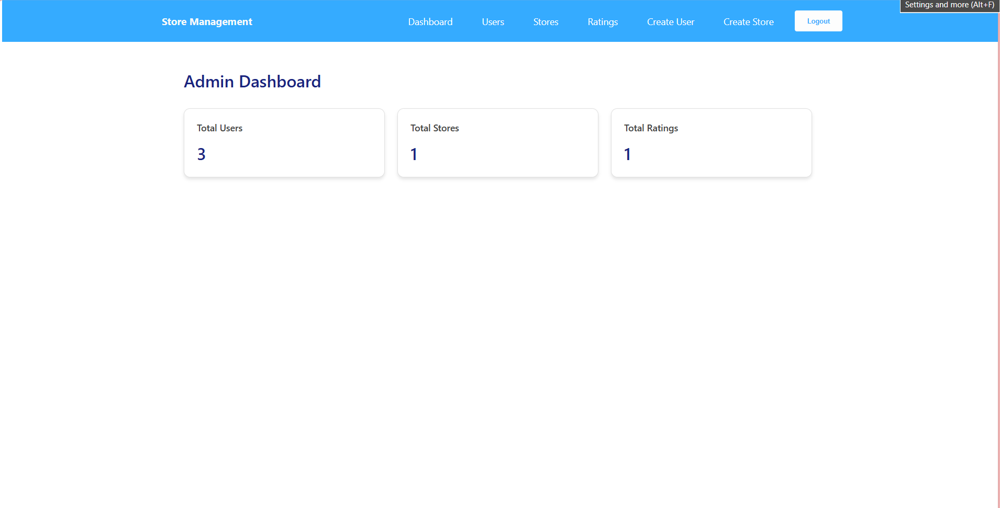
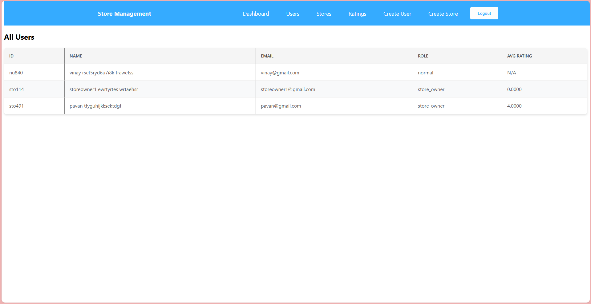
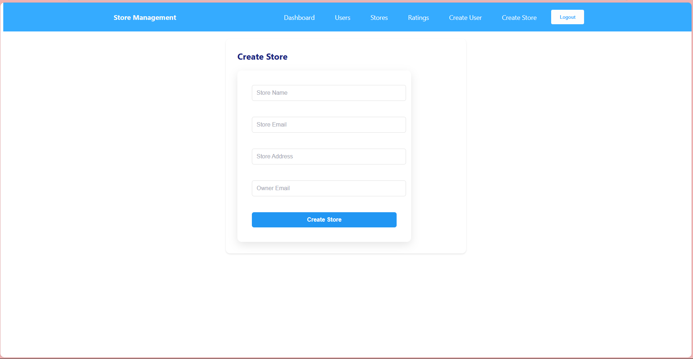
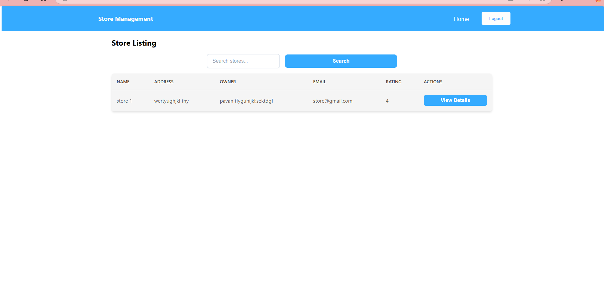
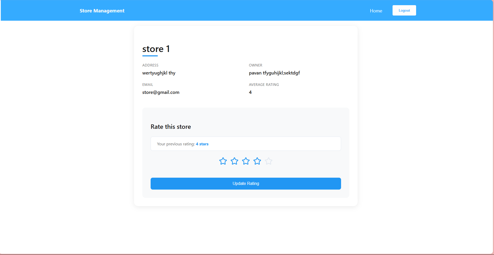

Store Rating Application

Overview

The Store Rating System is a web application that allows users to rate and review stores. It includes an admin panel for managing stores, users, and ratings.

Screenshots

User authentication (Login/Signup)

add /modify rating of stores

Admin panel for managing users, stores, and ratings

Store owners can view their store's ratings

Responsive UI built with React

Installation and Setup

1. Clone the Repository

git clone https://github.com/swarnalatha026/storeratingApp.git
cd StoreRatingSystem

2. Backend Setup (Node.js + Express + MySQL)

cd backend
npm install

Configure Environment Variables

Create a .env file inside the backend folder and add:

PORT=.....
DB_HOST=localhost
DB_USER=root
DB_PASS=.......*
DB_NAME=storeratingdb
DB_PORT=.....
JWT_SECRET=.......

Start the Backend Server

npm run dev --> Run to create tables initally and stop the server then run below command
node hashAdmin.js --> to insert the admin credentials initally
then run again to run the backend
npm run dev 

3. Frontend Setup (React)

cd ../reviewfeapp
npm install

Start the Frontend Server

npm start

4. Access the Application

Backend API runs on: http://localhost:5000

Frontend runs on: http://localhost:3000

Technologies Used

Frontend: React, Redux, CSS

Backend: Node.js, Express, MySQL

Authentication: JWT
